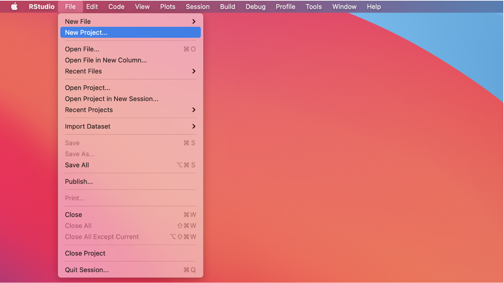
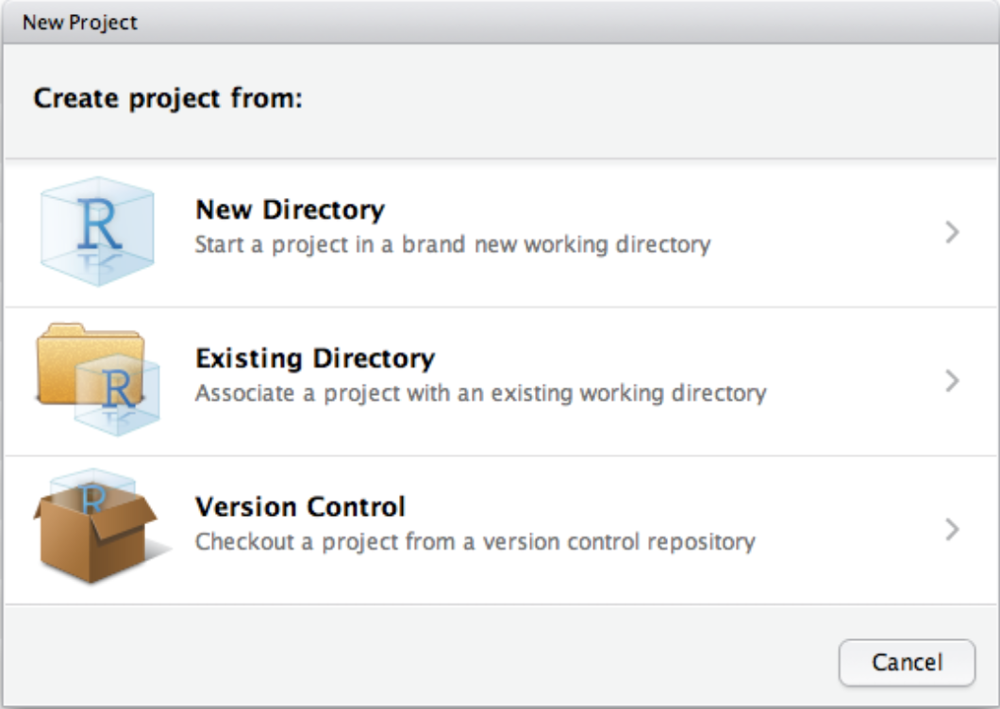
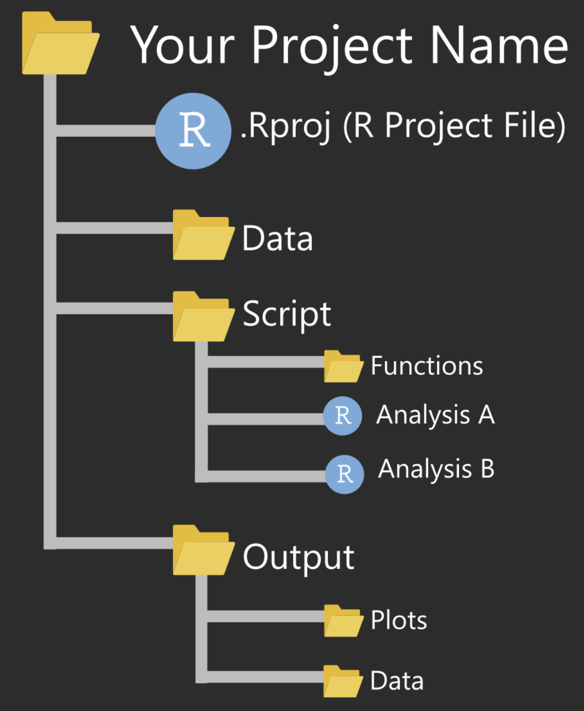

- Create a directory for the class, you can organize that directory
however you want but it's always better to have things in the same place. 

- Open Rstudio and create a project inside the directory you just created.
To create a new project:

  1. Go to `file` and `click` create a new project.
  
  
  1. Then click on the "Existing Directory" option.
  
  
  1. On the new window click the browse option and select the directory you 
  created in step one.
  
Projects allow us to organize our work and bypass the problem of setting a 
working directory every time we start working with a new data set.

Here is an example of a project organization:

When you open a project in RStudio, it automatically sets up the working 
directory to the root directory of the project.

## Now it's your turn.

1. Create a new directory named "extra" in your class directory.

1. Create a new directory named "`data`" in the "`extra`" folder.

1. Download the file "example.csv" located in the R/RStudio module on canvas, 
and then save that file to the "`data`" directory you created.

1. Open RStudio and start a new R markdown file.

1. Using a code chunk load the data into the environment (if your not sure how
check the cheat-sheet "`rmarkdown.pdf`")

1. Calculate the mean and standard deviation of the two variables in the data 
set and print them using the inline code function.

1. Draw a histogram of both variables (you can use base R or ggplot2, 
check the "`data-visualization.pdf`" cheat-sheet if you want to know how to 
do it in ggplot2).

1. Draw a scatter plot of x vs y.
